# 4.2-tooling
Домашнее задание ШРИ Tooling-2

Исследование страницы [https://www.gd.ru/articles/9039-finansovyy-kontrol](https://www.gd.ru/articles/9039-finansovyy-kontrol)

## 1. Вкладка Network
### 1.1 [HAR](network_www.gd.ru.har)
### 1.2 Неоптимальные места
- Дублирующие ресурсы 
    - https://tbcdnwidgetsprod.azureedge.net/widget/fonts/fontawesome-webfont.woff2?v=4.7.0 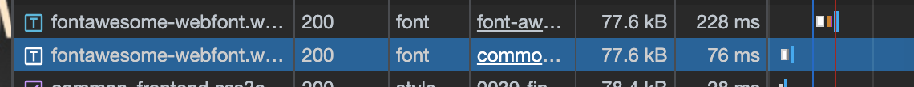
    - https://vk.com/js/api/openapi.js 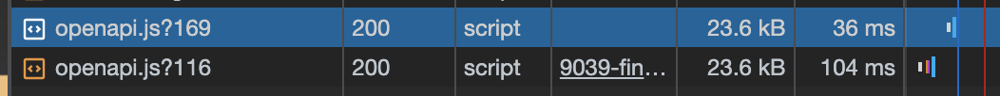
    - https://top-fwz1.mail.ru/js/code.js 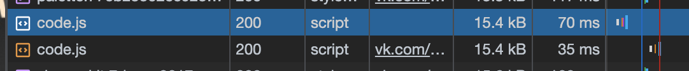

## 2. Вкладка Performance
### 2.1 Профиль [JSON](Trace-20230618T192635)
### 2.2 Время загрузки до важных моментов
- Загрузка
    - First Paint (FP) - 722.24мс
        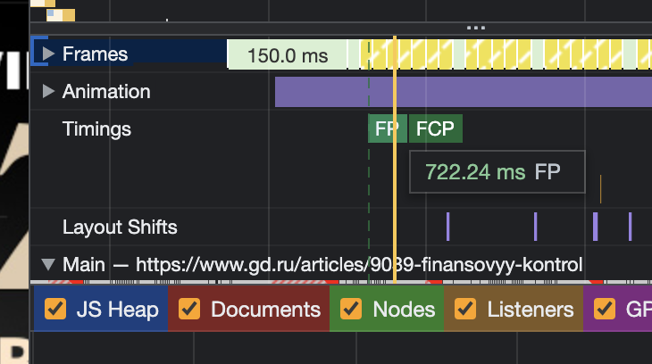
    - First Contentful Paint (FCP) - 722.24мс 
        
    - Largest Contentful Paint (LCP) - 1.81с 
        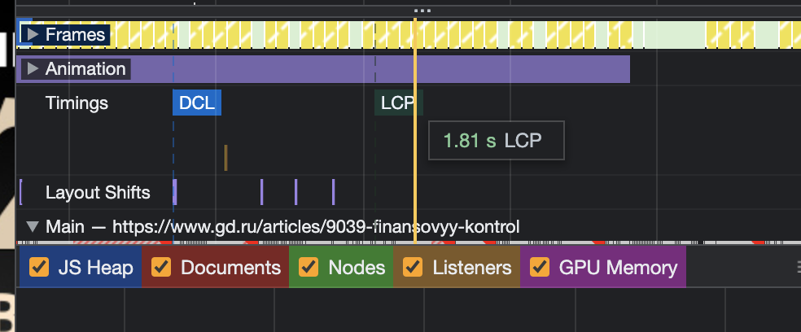
    - DOM Content Loaded (DCL) - 1.54с 
        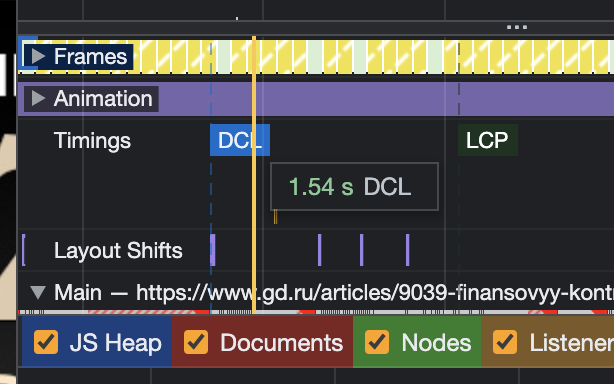
    - Load - 3.02с 
        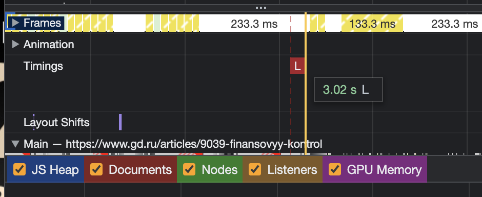

### 2.3 LCP
- LCP - это черное изображение, которое даже не всегда видно 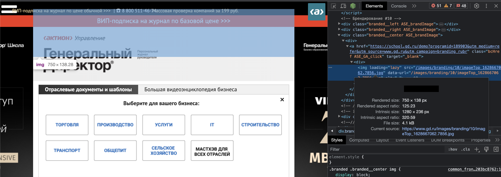

### 2.4 Время затраченное на разные этапы обработки документа
- Loading - 46мс
- Scripting - 1897мс
- Rendering - 732мс
- Painting - 72мс
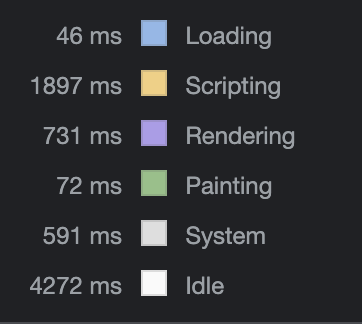

## 3 Вкладка Coverage

### 3.1 Скрин вкладки 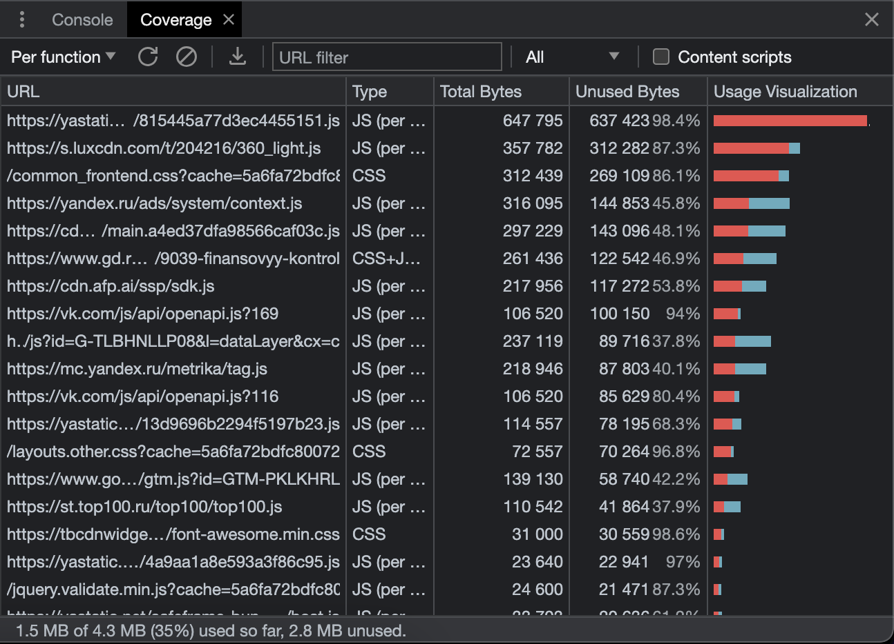

### 3.2 CSS - 560 KB 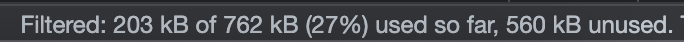

### 3.3 JS - 2300 KB 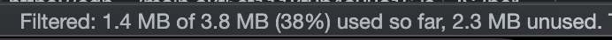